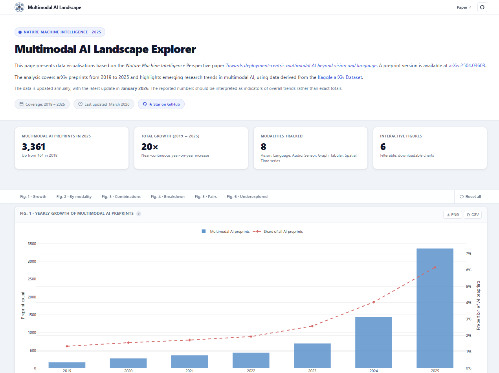

# Multimodal AI Landscape — [Explorer 🔍](https://multimodalai.github.io/multimodal-ai-landscape/)

<div align="left">

[](https://doi.org/10.1038/s42256-025-01116-5)
[](https://arxiv.org/abs/2504.03603)


</div>

Navigate with the [**Interactive Explorer**](https://multimodalai.github.io/multimodal-ai-landscape/).

<div align="center">
  <a href="https://multimodalai.github.io/multimodal-ai-landscape/">
    
  </a>
</div>
<div align="center" style="margin-top: 0; margin-bottom: 12px;">
  <em>Click the image to explore.</em>
</div>

This repository analyses arXiv preprints from 2019 to 2025 to reveal emerging trends in multimodal AI research.
The raw data were sourced from the [Kaggle arXiv Dataset](https://www.kaggle.com/datasets/Cornell-University/arxiv) and filtered using targeted search queries.

As arXiv metadata are subject to retrospective updates, counts may vary between dataset snapshots.
The query process is also inherently approximate — the reported numbers should be interpreted as indicators of overall trends rather than exact totals.

The paper version is archived as the v2025 release.

---

## Explorer features

The interactive site is a multi-page static web application built with [Plotly.js](https://plotly.com/javascript/) and [PapaParse](https://www.papaparse.com/), deployed on GitHub Pages.

| Feature | Detail |
|---------|--------|
| **6 interactive figures** | Filterable charts covering growth, modality breakdown, combination types, and underexplored pairs |
| **Chip filters** | Multi-select and single-select filter groups; keyboard accessible (Space / Enter, `aria-checked`) |
| **Loading skeletons** | Animated shimmer bars shown while CSVs are fetched and parsed |
| **Error panels** | Graceful fallback if any data file fails to load |
| **Download PNG / CSV** | Per-figure buttons on every chart card |
| **Help tooltips** | `?` badge on each chart title reveals a description on hover or keyboard focus |
| **Sticky sub-nav** | Jump links to Fig. 1–6; active section highlighted via `IntersectionObserver` |
| **Dynamic "Last updated"** | Resolved from the GitHub Commits API (24 h `localStorage` cache) with a static fallback |
| **Dynamic copyright year** | Set at runtime from `new Date().getFullYear()` |
| **Mobile responsive** | Single-column below 920 px; nav collapses to hamburger below 780 px |
| **CSV cache** | Each data file fetched only once per page session |

---

## Repository structure

```
multimodal-ai-landscape/
├── index.html                        # Main multimodal AI dashboard (2019–2025)
├── material.html                     # Materials-focused dashboard (2020–2025)
├── assets/
│   ├── css/styles.css                # Shared stylesheet (design tokens, layout, components)
│   ├── js/
│   │   ├── common.js                 # Shared helpers: CSV cache, nav/footer injection,
│   │   │                             #   color palette, chip factory, download helpers,
│   │   │                             #   dynamic last-updated resolver
│   │   └── explore.js                # All six chart renderers + dataset-selector logic
│   │   └── material-explore.js       # Materials page renderers (Fig. 1a/1b/3a/3b)
│   ├── img/multimodalai-logo.png     # Site logo (nav, footer, favicon)
│   └── meta/build.json               # CI-generated build timestamp (last-updated fallback)
├── data/
│   ├── datasets.json                 # Manifest listing all available datasets
│   ├── multimodal-ai-landscape/      # General multimodal AI dataset
│   │   ├── meta.json                 # Dataset descriptor (title, coverage, figure → CSV map)
│   │   ├── summary.json              # Precomputed stats for home-page cards
│   │   ├── overall-preprint-counts.csv
│   │   ├── preprint-counts-by-modality.csv
│   │   ├── preprint-counts-by-combined-modality-number.csv
│   │   ├── modality-combination-breakdown.csv
│   │   ├── modality-pairs-2024.csv
│   │   ├── modality-pairs-2025.csv
│   │   └── other-modality-combinations-by-year.csv
│   └── material-landscape/           # Materials science dataset
│       ├── meta.json
│       ├── summary.json
│       ├── fig1a-proportions.csv
│       ├── fig1b-property-design.csv
│       ├── fig3a-category-counts.csv
│       └── fig3b-category-proportions.csv
└── scripts/
    └── generate_datasets_manifest.mjs  # Node.js script: scans data/ and writes datasets.json
```

---

## Data filtering

### 1. Identifying multimodal AI and specific modalities

We first identified relevant AI preprints by searching titles and abstracts for common AI terms,
further refining the search with multimodal terms.
We then categorised these preprints by performing targeted queries for specific modalities.
The search terms and queries used are detailed in the query table below.

### 2. Query table

| **Terms**       | **Queries**                                                                                    |
|-----------------|------------------------------------------------------------------------------------------------|
| **AI**          | "AI", "A.I.", "artificial intelligence", "machine learning", "deep learning", "neural network" |
| **Multimodal**  | "multimodal", "multi-modal"                                                                    |
| **Vision**      | "vision", "image", "video", "visual"                                                           |
| **Language**    | "text", "language", "textual"                                                                  |
| **Time series** | "time series", "temporal"                                                                      |
| **Graph**       | "graph", "relational"                                                                          |
| **Audio**       | "audio", "acoustic", "speech", "sound", "voice", "phonetic", "music"                          |
| **Spatial**     | "spatial", "geospatial", "geographic", "GIS"                                                   |
| **Sensor**      | "sensor", "IoT", "sensory", "wearable", "RFID", "LiDAR", "radar", "Internet of Things"        |
| **Tabular**     | "tabular", "structured", "spreadsheet", "table", "categorical"                                 |

---

## Data files

All dataset CSV/JSON files live under the dataset-specific folders in `data/` (plus `data/datasets.json` as the top-level manifest).
Each dataset folder contains a `meta.json` descriptor that maps figure keys to CSV filenames,
allowing the site to resolve paths without hardcoding them in JavaScript.

### Multimodal AI dataset (`data/multimodal-ai-landscape/`)

| File | Description |
|------|-------------|
| [`overall-preprint-counts.csv`](data/multimodal-ai-landscape/overall-preprint-counts.csv) | Annual counts of multimodal AI preprints and their share of all AI preprints |
| [`preprint-counts-by-modality.csv`](data/multimodal-ai-landscape/preprint-counts-by-modality.csv) | Year-on-year counts broken down by primary modality |
| [`preprint-counts-by-combined-modality-number.csv`](data/multimodal-ai-landscape/preprint-counts-by-combined-modality-number.csv) | Counts by number of modalities combined (pairwise, triple, etc.) |
| [`modality-combination-breakdown.csv`](data/multimodal-ai-landscape/modality-combination-breakdown.csv) | Split between Vision & Language vs. other combinations within each type |
| [`modality-pairs-2024.csv`](data/multimodal-ai-landscape/modality-pairs-2024.csv) | Ranked frequency of modality pairs — 2024 |
| [`modality-pairs-2025.csv`](data/multimodal-ai-landscape/modality-pairs-2025.csv) | Ranked frequency of modality pairs — 2025 |
| [`other-modality-combinations-by-year.csv`](data/multimodal-ai-landscape/other-modality-combinations-by-year.csv) | Trend lines for less common modality combinations |

### Materials dataset (`data/material-landscape/`)

| File | Description |
|------|-------------|
| [`fig1a-proportions.csv`](data/material-landscape/fig1a-proportions.csv) | Yearly proportions of multimodal AI, generative AI, and multimodal-generative AI within materials AI publications |
| [`fig1b-property-design.csv`](data/material-landscape/fig1b-property-design.csv) | Yearly counts of property prediction vs materials design publications |
| [`fig3a-category-counts.csv`](data/material-landscape/fig3a-category-counts.csv) | Yearly absolute counts across composition, microstructure, processing, and testing/characterisation |
| [`fig3b-category-proportions.csv`](data/material-landscape/fig3b-category-proportions.csv) | Yearly proportional split across the four materials data categories |
| [`summary.json`](data/material-landscape/summary.json) | Precomputed stats used by cards and high-level summaries |
| [`meta.json`](data/material-landscape/meta.json) | Dataset descriptor including title, coverage, page route, and figure-to-file mapping |

---

## Contributing

Contributions are welcome. Please open an issue before submitting a pull request for significant changes.

To add a new dataset:
1. Create `data/<dataset-id>/` containing `meta.json`, `summary.json`, and your CSV files. Ensure `<dataset-id>` exactly matches the `id` field in `meta.json`, which is used for path resolution.
2. Run `node scripts/generate_datasets_manifest.mjs` to regenerate `data/datasets.json`.
3. Open a pull request with the new dataset folder and the updated manifest.

---

## Citation

```bibtex
@article{liu2025towards,
  title   = {Towards deployment-centric multimodal AI beyond vision and language},
  author  = {Liu, Xianyuan and Zhang, Jiayang and Zhou, Shuo and van der Plas, Thijs L.
             and Vijayaraghavan, Avish and Grishina, Anastasiia and Zhuang, Mengdie
             and Schofield, Daniel and Tomlinson, Christopher and others},
  journal = {Nature Machine Intelligence},
  volume  = {7},
  pages   = {1612--1624},
  year    = {2025},
  doi     = {10.1038/s42256-025-01116-5},
  url     = {https://doi.org/10.1038/s42256-025-01116-5}
}
```
